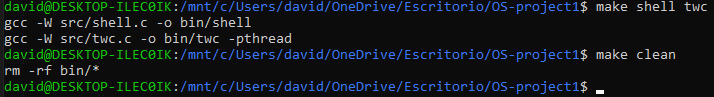
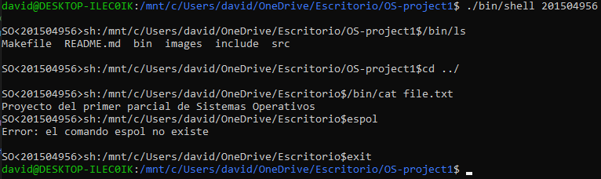
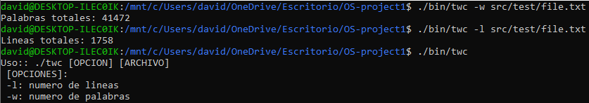
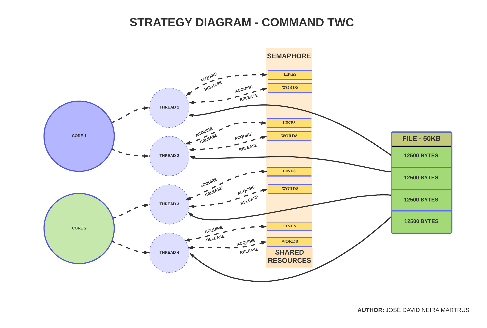

PROYECTO PRIMER PARCIAL
======================
Version 1.0 - 01/12/2019

1 - Descripción
---------------
* **Parte 1 - Elaborar un nuevo shell:** Programa desarrollado en lenguaje C capaz de reconocer los comandos internos exit y cd, en donde el primero permitirá salir del programa, y el segundo está diseñado para cambiar de directorios. El nuevo shell, invoca a todos los ejecutables y argumentos pasados mediante la linea de comandos. Se mostrará un prompt con el directorio actual y un id de estudiante, el cual será ingresado como argumento del programa.

* **Parte 2 - Una versión mejorada del comando wc (twc):** Programa que genera como salida el número de lineas y palabras existentes en un archivo dado. El programa desarrollado en C usa la librería pthread para maximizar el uso de los núcleos disponibles en el sistema, en cada uno de los núcleos habrá un hilo procesando un bloque del archivo, se utilizan semáforos para sincronizar el trabajo de los hilos en las regiones críticas.

El comando twc recibe los siguientes parámetros:

* **-w :** El número de palabras en cada archivo de entrada se escribe en la salida estándar.
* **-l :** El número de líneas en cada archivo de entrada se escribe en la salida estándar.


2 - Compilando el proyecto
----------------------------
El proyecto dispone de un archivo Makefile para compilar el código fuente.

* **Instrucciones para compilar:**
```
make shell twc
```
* **Para limpiar:**
```
make clean
```
Se generarán los ejecutables **shell** y **twc** en el directorio **/bin**



3 - Modo de uso general
------------------------

* **Programa Shell**
```
./bin/shell <student_id>

```

* **Comando twc**

```
./bin/twc <-l|-w> <file_name>

```


**NOTA:** Se creó un archivo de cabecera llamado csapp.h el cual posee ciertos identificadores usados en ambos programas.

4 - Estrategia
---------------
La estrategia utilizada para resolver el segundo problema planteado consiste en dividir un archivo en partes iguales y conocer la cantidad de cores que tiene el computador; el propósito es asignar hilos en cada uno para maximizar el uso de los recursos disponibles, los hilos recibirán un bloque de bytes que deberán procesar (contar palabras y lineas). Se utilizan semáforos en las regiones críticas para resolver las condiciones de carrera, en este caso, existen dos recursos compartidos (variables líneas y palabras), los cuales son modificados por hilos de forma sincronizada gracias al uso de los semáforos. En el programa se producirá un spin-lock y será útil ya que el bloqueo es corto, mientras un hilo gire en un core, otro hilo podrá pasar por la sección crítica en otro core.
A continuación, se puede observar el diagrama de la estrategia utilizada.



5.- Problemas y funcionalidades extras
---------------
> **Shell** 
* Se tuvo que Ignorar la señal SIGINT>CTRL+C en el proceso padre, ahora se puede interrumpir un proceso hijo sin matar al programa shell, la forma de salir es por medio de exit o deteniéndolo con una señal SIGTSTP.
* Se usa la llamada del sistema getcwd() para mostrar en el prompt el directorio actual, es decir, si el usuario usa el comando cd para cambiar de directorio, el prompt reflejará dicho cambio.

> **Comando twc**
* Se usan dos semáforos para manejar las tres regiones críticas del programa.
* La lectura del archivo es realizada por medio de llamadas al sistema.
* Se utiliza asignación de memoria dinámica para hilos,buffer y estructuras, luego dicha memoria reservada es liberada cuando ya no se necesita, con la finalidad de evitar fugas de memoria.
* Un problema detectado es busy waiting ya que mientras un hilo está en su sección crítica, cualquier otro hilo que intente ingresar debe realizar un bucle continuo en el código de entrada (spin-lock). En esta espera se desperdician los ciclos de la CPU en lugar de usarlos productivamente. Evidentemente en este programa el spin-lock puede resultar eficiente porque los bloqueos son cortos, pero si se trata de un problema más complejo en donde las secciones críticas son largas, el busy waiting provocará ineficiencia extrema. 

6 - Autor
-----------

* José David Neira Martrus
